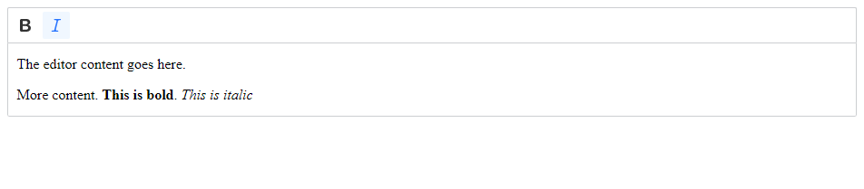

# CKEditor Custom Build

A sample CKEditor Custom Build[^1]

Demo working:

[^1]: [Customized installation - CKEditor 5 Documentation](https://ckeditor.com/docs/ckeditor5/latest/installation/getting-started/quick-start-other.html#building-the-editor-from-source)
